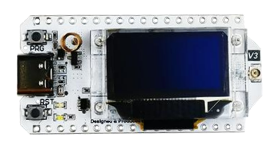

# ESP-IDF RadioLib Component and Oled Display Component for Heltec WiFi LoRa V3 (ESP32-S3)



## Overview

This project is an **adapted version of [RadioLib](https://github.com/jgromes/RadioLib)** tailored for the **ESP-IDF** framework, specifically targeting the **ESP32-S3 MCU** used in the **Heltec WiFi LoRa V3** development board.

It includes:
- A dedicated **Hardware Abstraction Layer (HAL)** implementation for the ESP32-S3.
- Preconfigured **LoRa (SX1262)** support with **ready-to-use components**.
- Optional availability for other radio modules (LR11x0, FSK..) and protocols (such as lorawan) included in RadioLib for flexibility.
- A display component to control the **built-in OLED** of the Heltec board.
- A basic example demonstrating **LoRa communication + OLED display output**.

## Key Features

- ✅ ESP-IDF native support (component-based)
- ✅ Ready to use for Heltec WiFi LoRa V3 (ESP32-S3 + SX1262)
- ✅ Maintains compatibility with other RadioLib protocols (e.g., LoRaWAN, FSK, RTTY)
- ✅ OLED display driver component included
- ✅ Clean example showing LoRa + display usage

---

## Getting Started

This project follows the **standard ESP-IDF component structure**, so setup and usage are familiar to anyone working with ESP32 development.

### 1. Prerequisites

- ESP-IDF (v5.0 or later recommended)
- ESP32-S3 Toolchain
- Heltec WiFi LoRa V3 development board (or other board featuring an esp32S3 MCU)

### 2. Cloning the Project

```bash
git clone https://github.com/Rorschak84/esp-idf-with-RadioLib.git
cd esp-idf-with-RadioLib
```

### 3. Mapping the correct PINS
 
if you use the Heltech LoRa Wifi V3, you can skip this phase.

Otherwise, you need to ensure the SPI pins for the RF Transceiver and the I2c pins for the Oled Display are correct.
Refer to the datasheet of the manufacturer.
You can also consult a project made by RadioLib, named "RadioBoard", that gathered numerous pin configurations from various vendors:

The SPI Pins for the RF transceiver are specified in the main.cpp file while the I2C pins are specified in the oled_display component.


### 4. Building and Flashing

```bash
idf.py set-target esp32s3
idf.py build
idf.py flash
idf.py monitor
```

Make sure the sdkconfig is adapted to the board you're using ! The current sdkconfig is ready to be used for ESP32-S3 MCUs

## 5. Portability to Other ESP-IDF Targets and Transceivers

While this project is specifically tailored to the **Heltec WiFi LoRa V3** (ESP32-S3 + SX1262), it is designed with modularity in mind and can be **reused across different ESP32-based boards** and **LoRa/RF modules**, by adapting the hardware abstraction layer (HAL).

### 🧩 Supporting Other MCUs

The core logic and component structure are based on **ESP-IDF best practices**, making it easy to port this codebase to other **ESP32**, **ESP32-C**, or **ESP32-S** variants. To do so:

1. Implement a new HAL in the style of `ESP32XXXXX.cpp` for your MCU.
2. Provide the appropriate GPIO, SPI, and interrupt mappings.
3. Register the HAL implementation with the RadioLib instance.

Reference implementation:  
👉 [RadioLib ESP-IDF HAL Example](https://github.com/jgromes/RadioLib/tree/master/examples/NonArduino/ESP-IDF)

---

### 📶 Supporting Other LoRa / RF Modules

Although the Heltec board features the **Semtech SX1262**, this project includes the full RadioLib definitions for many other transceivers, including:

- SX127x series
- RFM69
- LoRaWAN-capable modules
- FSK / OOK / Morse / RTTY modems

To use a different module:
1. Wire it up to the SPI bus.
2. Adjust the pin mappings accordingly.
3. Instantiate the appropriate RadioLib driver (e.g., `SX1278`, `RFM95`) in your application code.

> ⚠️ Only SX1262 has been tested in this project. Other modules may require testing and minor adjustments.

---

This flexibility allows you to **reuse this codebase as a general-purpose RF communication layer for ESP-IDF projects**, not just those based on the Heltec board.


## Acknowledgments

This project builds upon the outstanding work of the following:

- **[RadioLib](https://github.com/jgromes/RadioLib)** by *Jan Gromes* – A powerful and flexible wireless communication library supporting a wide range of RF modules and protocols. This project adapts RadioLib's architecture to the ESP-IDF ecosystem and the ESP32-S3 platform.
- **[Heltec Automation](https://heltec.org/)** – For providing the **Heltec WiFi LoRa V3** development board, a compact and capable platform that integrates LoRa, Wi-Fi, Bluetooth, and OLED display functionality in a single module.
- The **ESP-IDF** team at *Espressif* – For creating a robust and extensible development framework tailored for the ESP32 series of MCUs.

Special thanks to the open-source community for fostering an environment where collaboration and knowledge-sharing make projects like this possible.